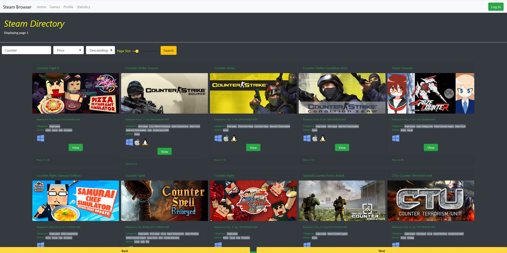
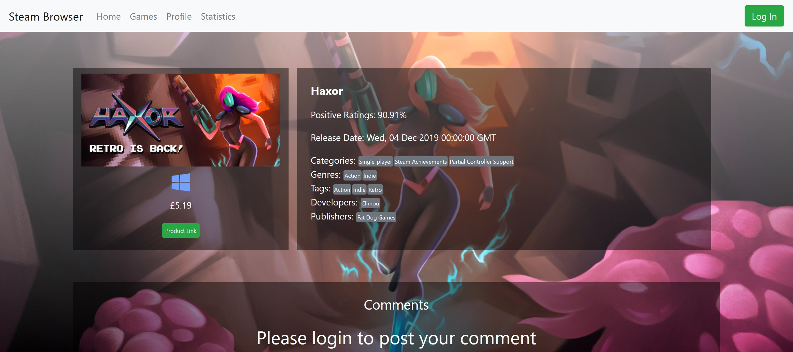
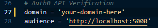
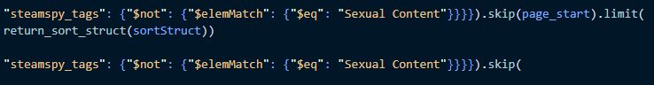
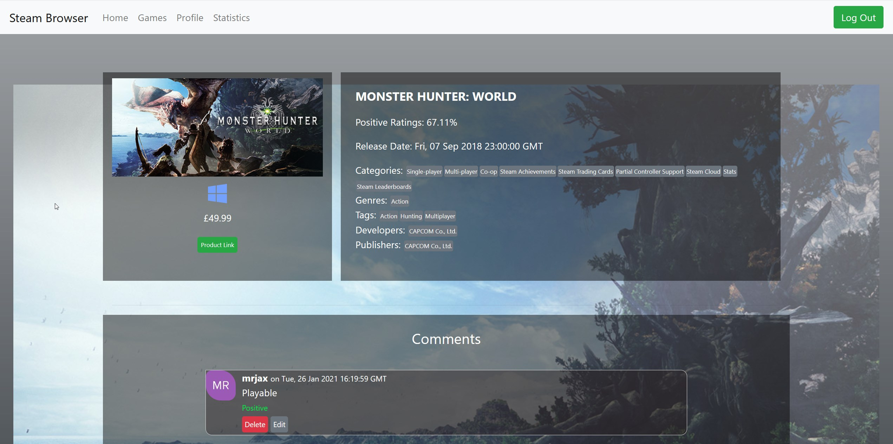
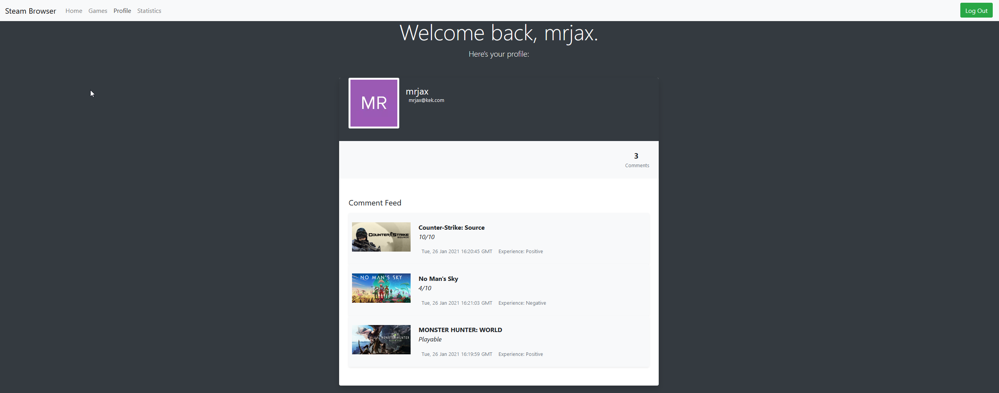

# Steam Library Browser

Lists a crawled library of steam-games with some classifications and filtering options. JSON File included with data crawled from 2019.

## Set-Up

> Extract GameListings.7z within MONGO_IMPORT folder and import the JSON file into your Mongo database.
>
> > Over 27,000 STEAM games from from Sept 2019.

> Install all deps from server/app.py
>
> > IMPORTANT - pip install python-jose instead of jose.

> npm i all dependenciens in the main directory and ng-serve.

Configure your Auth0/Google API keys for 0Auth authentication to leave/edit/remove comments.

> 

I've hardcoded hiding of explicit content, which can be sorted in flask server lines 345-350.

> 

### Commenting

### Simple Profile

